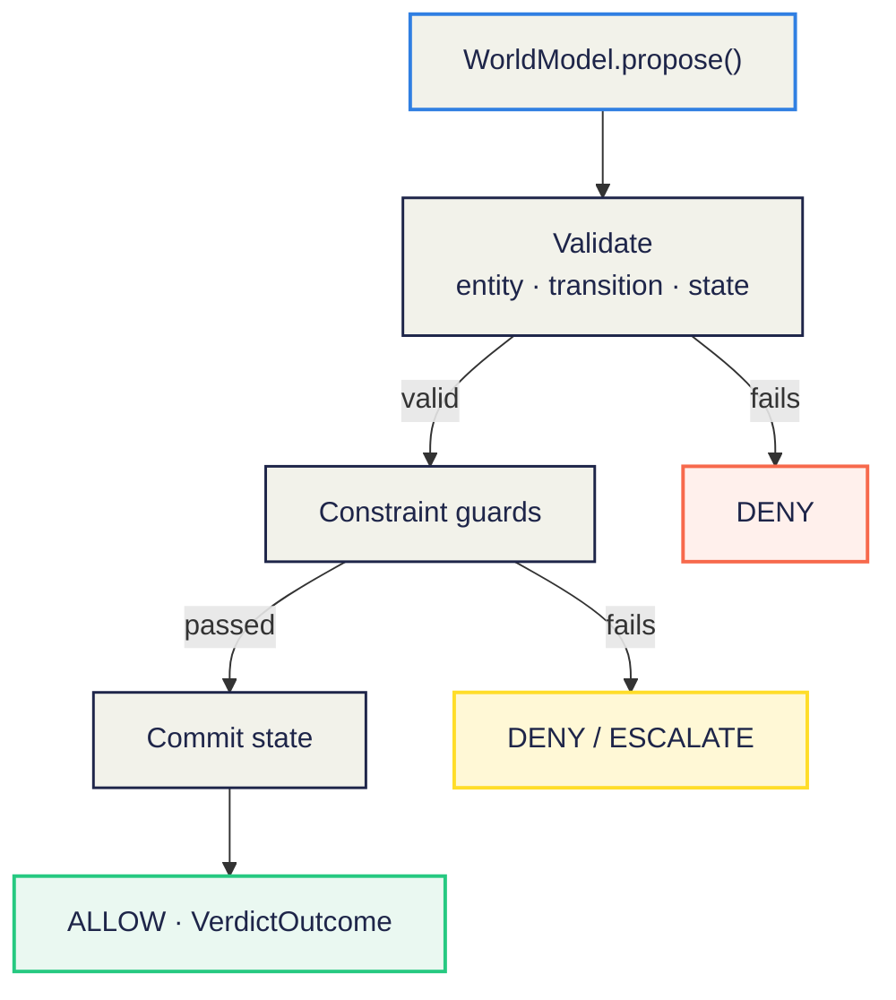
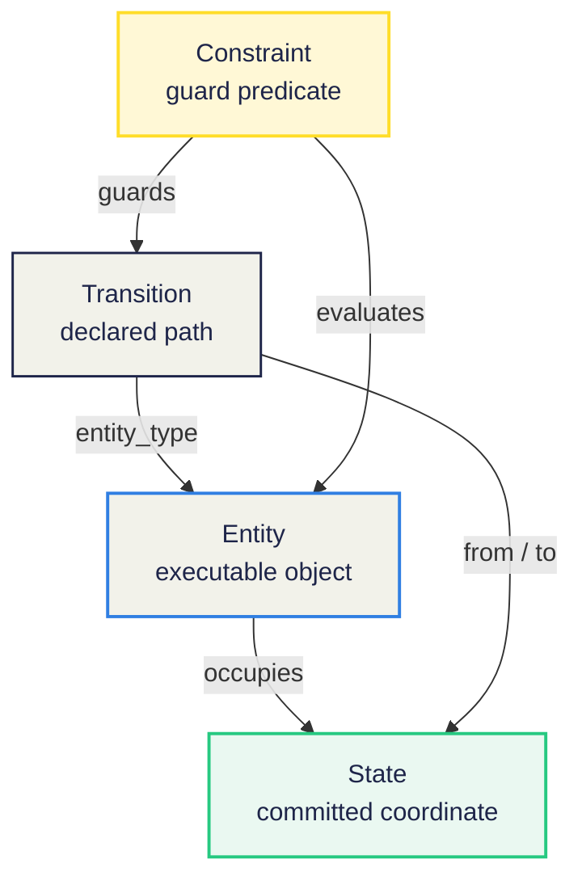

# estc-world-model

**Entity-State-Transition-Constraint runtime for production-grade AI agents.**

Most AI agent projects start with prompts and tools. Production agentic systems should start with a world.

`estc-world-model` is a lightweight Python package for turning an agentic world model into executable code. It lets you define entities, states, transitions, and constraints, then validate agent-proposed transitions, commit allowed state changes, and return structured `VerdictOutcome` objects.

```text
Prompt → Candidate Transition → Guard → Commit → VerdictOutcome
```

## Why this exists

Tool-calling alone does not make an AI agent production-ready. A tool call can change the world, but it does not by itself know:

- what entity is being changed,
- what the current committed state is,
- which transitions are allowed,
- which constraints must be enforced,
- what should be recorded after execution.

`estc-world-model` provides a minimal runtime for that missing layer.

## Runtime flow



## Installation

```bash
pip install estc-world-model
```

For local development:

```bash
git clone https://github.com/swit001/estc-world-model.git
cd estc-world-model
pip install -e .
```

## Quick start

```python
from estc_world_model import Constraint, Entity, Transition, WorldModel

order = Entity(
    id="order_123",
    type="Order",
    state="Delivered",
    attributes={
        "days_since_delivery": 5,
        "refundable": True,
    },
)

request_refund = Transition(
    name="RequestRefund",
    entity_type="Order",
    from_state="Delivered",
    to_state="RefundRequested",
)

refund_within_seven_days = Constraint(
    name="RefundWithinSevenDays",
    applies_to="RequestRefund",
    description="Refunds are allowed only within 7 days after delivery.",
    predicate=lambda entity: entity.attributes["days_since_delivery"] <= 7,
)

world = WorldModel(
    entities=[order],
    transitions=[request_refund],
    constraints=[refund_within_seven_days],
)

verdict = world.propose(
    entity_id="order_123",
    transition="RequestRefund",
    requested_by="customer_456",
)

print(verdict.model_dump_json(indent=2))
```

Example output:

```json
{
  "status": "ALLOW",
  "requested_transition": "RequestRefund",
  "entity_id": "order_123",
  "approved_action": "RequestRefund",
  "rejected_action": null,
  "next_state": "RefundRequested",
  "guards_passed": [
    "RefundWithinSevenDays"
  ],
  "guard_result": [
    {
      "name": "RefundWithinSevenDays",
      "passed": true,
      "reason": null
    }
  ],
  "committed_state": {
    "entity_id": "order_123",
    "entity_type": "Order",
    "previous_state": "Delivered",
    "current_state": "RefundRequested"
  },
  "alternatives": [],
  "audit_ref": "audit_...",
  "message": "Transition committed by customer_456."
}
```

## ESTC relationship



## Core concepts

### Entity

An entity is the executable object whose state can be changed.

```python
Entity(id="order_123", type="Order", state="Delivered")
```

### State

A state is the committed coordinate of an entity. The runtime treats `entity.state` as the current committed state.

### Transition

A transition is a declared path from one state to another.

```python
Transition(
    name="RequestRefund",
    entity_type="Order",
    from_state="Delivered",
    to_state="RefundRequested",
)
```

### Constraint

A constraint is a guard that determines whether a transition can proceed.

```python
Constraint(
    name="RefundWithinSevenDays",
    applies_to="RequestRefund",
    predicate=lambda entity: entity.attributes["days_since_delivery"] <= 7,
)
```

### VerdictOutcome

A `VerdictOutcome` is the structured result returned by the world model after evaluating a transition candidate.

Possible statuses:

- `ALLOW`
- `DENY`
- `ESCALATE`

## Canvas to code

The package is designed as the executable companion to a World Model Canvas.

```text
World Model Canvas
    ↓
ESTC specification
    ↓
Python runtime
    ↓
VerdictOutcome
```

A canvas cell such as:

```yaml
entity: Order
state: Delivered
transition: RequestRefund
constraint: days_since_delivery <= 7
```

becomes:

```python
order = Entity(id="order_123", type="Order", state="Delivered")
request_refund = Transition(
    name="RequestRefund",
    entity_type="Order",
    from_state="Delivered",
    to_state="RefundRequested",
)
refund_rule = Constraint(
    name="RefundWithinSevenDays",
    applies_to="RequestRefund",
    predicate=lambda entity: entity.attributes["days_since_delivery"] <= 7,
)
```

## Example domains

This repository starts with a minimal commerce refund example implemented entirely in Python:

```bash
python examples/commerce_refund/demo.py
```

YAML world definitions are supported from v0.2.0.

Run the YAML-based demo:

```bash
python examples/commerce_refund/demo_yaml.py
```

Planned examples:

- Commerce: order cancellation, refund request, partial return
- Marketing: campaign budget exhaustion, creative approval, audience overlap
- HR: candidate pipeline, interview scheduling, offer approval

## Roadmap

- [x] Pydantic models for Entity, Transition, Constraint, VerdictOutcome
- [x] Minimal transition validation and commit runtime
- [x] Commerce refund example
- [x] Marketing budget example
- [x] YAML loader for declarative world definitions
- [x] CLI: `estc validate world.yaml`
- [ ] JSON Schema export
- [ ] Belief vs committed state example
- [ ] NWM → SWM runtime demo
- [ ] Domain templates for commerce and marketing


## CLI

`estc-world-model` includes a small CLI for validating declarative ESTC world definitions.

```bash
estc validate examples/commerce_refund/world.yaml
```

Successful output:

```json
{"valid": true, "world": "Commerce Refund World", "entities": 0, "transitions": 3, "constraints": 3}
```

Invalid world definitions return exit code `1`:

```text
Error: Missing required field 'entity_type' in transition: {...}
```

The validator checks YAML structure, required transition fields, required constraint fields, and safe constraint rule syntax. It does not execute transitions; runtime execution is handled through the Python API.


## YAML loader

`estc-world-model` can load declarative ESTC world definitions from YAML.

```python
from estc_world_model import Entity, load_world_from_yaml

order = Entity(
    id="order_123",
    type="Order",
    state="Delivered",
    attributes={
        "days_since_delivery": 5,
        "item_refundable": True,
        "refund_status": "none",
    },
)

world = load_world_from_yaml(
    "examples/commerce_refund/world.yaml",
    entities=[order],
)

verdict = world.propose(
    entity_id="order_123",
    transition="RequestRefund",
)
```

YAML constraint rules use a deliberately small safe expression subset:

- `field == value`
- `field != value`
- `field <= value`
- `field >= value`
- `field < value`
- `field > value`

No `eval()` is used. Rules are parsed into explicit Python callables.

## Design Companion

This repository is the runtime engine for executable world models.

If [`agentic-world-model`](https://github.com/swit001/agentic-world-model) is the canvas for designing the world, `estc-world-model` is the engine that turns Entity-State-Transition-Constraint design into executable agent behavior.

## License

Apache 2.0
